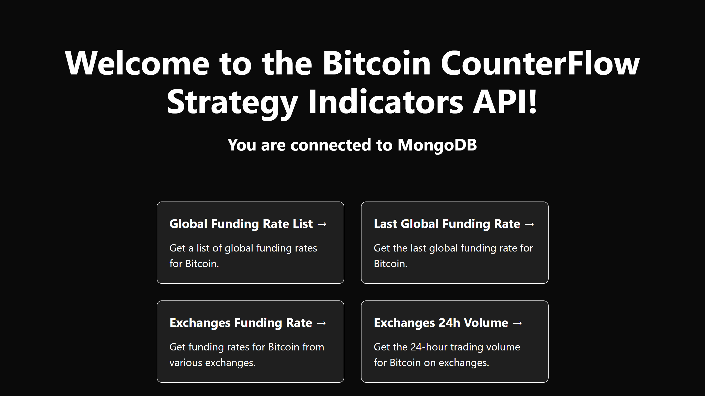

## API Readme

	

 

This API provides various endpoints for accessing data related to Bitcoin counterflow strategy indicators. It utilizes Next.js framework and MongoDB for data storage. Below, you will find information about the API endpoints and how to set up the project.

## Endpoints

The API offers the following endpoints:

+ Global Funding Rate List - /api/list-global-funding-rate
Get a list of global funding rates for Bitcoin.

+ Last Global Funding Rate - /api/last-global-funding-rate
Get the last global funding rate for Bitcoin.

+ Exchanges Funding Rate - /api/exchanges-funding-rate
Get funding rates for Bitcoin from various exchanges.

+ Exchanges 24h Volume - /api/volume
Get the 24-hour trading volume for Bitcoin on exchanges.

+ Liquidations - /api/liquidations
Get information about liquidations in the Bitcoin market.

+ Alarms - /api/alarms
Set alarms for specific conditions in the Bitcoin market.

## Project Setup

To set up the project, follow the steps below:

1. Install dependencies:
Run npm install to install the required dependencies listed in the package.json file.

2. Configure MongoDB:
Ensure you have MongoDB installed and running.
Set the MONGODB_URI environment variable with the connection URI for your MongoDB database.

3. Start the development server:
Run npm run dev to start the Next.js development server.

4. Access the API:
Once the server is running, you can access the API endpoints mentioned above.

## Additional Notes

+ If you're using a different database (e.g., myDatabase) within your MongoDB, you can modify the connection code in the getServerSideProps function in pages/index.js file.

+ The API relies on the connectToDatabase function in the lib/connectToDatabase.js file to establish a connection with MongoDB.

+ The API utilizes Next.js server-side rendering (SSR) with the getServerSideProps function to fetch data and pass it as props to the Home component in pages/index.js.

+ The Home component renders a welcome message and provides links to the different API endpoints.

+ The API utilizes the mongodb package for querying the database and retrieving data.

+ In the production environment, the API connects to MongoDB directly. In the development environment, the connection is stored in a global variable to preserve the value across module reloads caused by Hot Module Replacement (HMR).

Feel free to explore the code and customize it according to your requirements. If you encounter any issues or have further questions, please let us know.